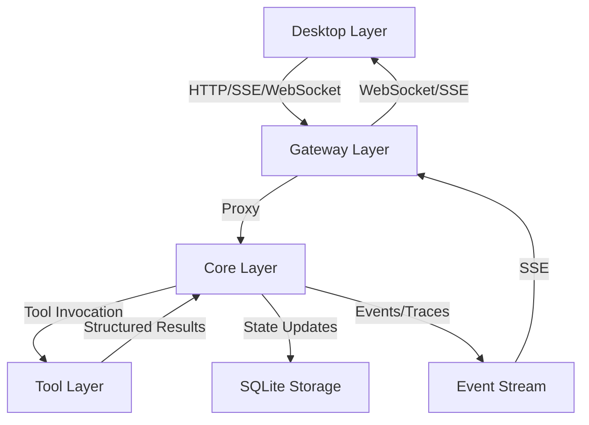

# PROJECT KNOWLEDGE BASE

**Generated:** 2026-05-30
**Generated By:** openai/gpt-5.5
**Last Updated:** 2026-07-12
**Last Updated By:** Codex (Git read tools)
**Last Verified Commit:** 1b7de0eb40e474edd6f87772e7b99e62701034da
**Branch:** main

## AI MAINTENANCE PROTOCOL
- Treat this file and nested `AGENTS.md` files as living project memory, not static docs.
- Before relying on a rule that looks stale, contradictory, or surprising, verify against source files, configs, scripts, and docs.
- If verified reality differs from this file, update the relevant `AGENTS.md` immediately in the same change.
- When changing code, configs, commands, ports, contracts, module boundaries, or build/test workflows, update affected `AGENTS.md` files in the same work item.
- When modifying any `AGENTS.md`, update the metadata above: `Last Updated`, `Last Updated By`, `Last Verified Commit`, and `Branch`.
- Do not “fix” this file from memory alone; cite current repo evidence in the edit rationale or final message.
- Keep entries concise and project-specific. Remove obsolete guidance instead of appending conflicting notes.

## OVERVIEW
TinadecOffice is a Windows-first intelligent agent desktop workbench built around a universal agent harness. The repo combines a .NET 10 Core state/runtime service, an Elysia TypeScript Gateway, and an Electron + Vue desktop UI under one npm workspace root.

## THREE-LAYER ARCHITECTURE

TinadecOffice采用三层架构设计，每层有明确的职责边界和技术栈：

### Desktop层 (UI呈现层)
- **技术栈**: Electron + Vue 3 + Vite + Tailwind CSS
- **端口**: 5173 (Vite开发服务器)
- **主要职责**: 
  - 提供聊天界面、任务图、执行分派、上下文包、监督发现、审批和事件流
  - 包含Agent Debug Studio调试工具
  - 支持可分离的面板窗口
  - 通过HTTP/SSE/WebSocket与Gateway通信
- **关键组件**: 
  - Monaco Editor: 代码编辑器
  - Xterm.js: 终端模拟器
  - Node-pty: 伪终端支持
- **设计原则**: 只调用Gateway，不直接调用Core；不存储任何业务状态

### Gateway层 (BFF/API层)
- **技术栈**: Elysia TypeScript + Node.js
- **端口**: 48730
- **主要职责**: 
  - 作为Desktop和Core之间的代理层
  - 提供RESTful API端点（`/api/v1/*`）
  - 代理所有请求到Core层
  - 处理CORS和API文档（Swagger）
- **关键组件**: 
  - `codeTools.ts`: 代码工具执行
  - `coreClient.ts`: Gateway到Core的HTTP/SSE调用
  - `mcpRoutes.ts`: MCP协议支持
- **设计原则**: 薄代理模式，不存储任何状态；只代理请求，不实现业务逻辑

### Core层 (智能体编排层)
- **技术栈**: .NET 10 C# + ASP.NET Core
- **端口**: 48731
- **主要职责**: 
  - **唯一状态权威**: 管理会话、消息、项目、事件、审批等所有状态
  - **双层智能体编排**: Planning layer（主动规划与监督）和Execution layer（被动执行任务）
  - **工具执行与审批**: 通过审批门机制控制写操作
  - **模型路由**: 管理模型provider、route和settings
  - **持久化**: SQLite存储所有状态
  - **可观测性**: OpenTelemetry集成
- **关键服务**: 
  - `CoreStore`: SQLite持久化存储
  - `OrchestratorService`: 智能体编排服务
  - `ToolRegistryService`: 工具注册和管理
  - `HarnessManifestService`: harness清单服务
  - `RuntimeReadinessService`: 运行时就绪检查
- **设计原则**: 通用智能体编排模型，可被其他产品复用；通过接口治理工具，不硬编码工具逻辑

### TinadecTools (原型工具层)
- **技术栈**: .NET 10 C# + System.Text.Json source generation + official `ModelContextProtocol` SDK
- **作用**: 作为静态/非静态工具处理器的原型宿主，验证 AOT-safe JSON 与工具注册方式
- **注册方式**: 静态工具使用 `[ToolFunction(...)]` + source generator 生成注册表，可用 `RequiresApproval = true` 标记写工具；需要状态的工具可继承 `ToolHandlerBase<TArgs, TResult>` 并手动注册
- **MCP-Pass-Through**: `Tools/Mcp` 独立实现 `mcp_list`、`mcp_search`、`mcp_invoke`，从启动目录 `mcp_servers.json` 或 `TINADEC_TOOLS_MCP_CONFIG` 读取 stdio MCP server 配置；`mcp_invoke` 需要审批
- **边界**: 这里的 generator 只负责编译期生成静态注册代码，不承担 Core 层状态、审批或路由职责

## LAYER INTERACTION AND DATA FLOW

### 典型用户请求流程
1. 用户在Desktop发起目标、选择项目、配置模式或审批动作
2. Desktop调用Gateway（端口48730）
3. Gateway代理请求到Core（端口48731）
4. Core创建或更新会话状态，生成run、task graph、agent assignment、context pack和supervision finding
5. Core根据工具描述和权限策略决定哪些只读工具可自动执行，哪些必须进入审批流程
6. Core通过工具适配器请求Tool layer
7. Tool layer调用对应工具实现，返回结构化结果
8. Core将结果写回step result、event、trace和状态存储
9. Desktop通过HTTP/SSE/WebSocket刷新UI

### 数据流向图


### 核心设计原则
1. **Core是唯一状态权威**: Gateway和Desktop不存储任何状态
2. **Desktop只调Gateway**: 不直接调用Core
3. **Code是Tool Layer内置工具套件**: 不是独立层
4. **审批门机制控制写操作**: 任何mutating action都必须经过审批
5. **API契约统一snake_case**: 所有API使用snake_case命名
6. **Windows优先**: 针对Windows平台优化

## KEY COMPONENTS AND MODULES

### Core层关键服务
- **CoreStore** (`src/TinadecCore/Storage/CoreStore.cs`): SQLite持久化存储，管理所有状态数据
- **OrchestratorService** (`src/TinadecCore/Services/OrchestratorService.cs`): 智能体编排服务，管理双层智能体模型
- **ToolRegistryService** (`src/TinadecCore/Services/ToolRegistryService.cs`): 工具注册和管理，通过接口治理工具能力
- **HarnessManifestService** (`src/TinadecCore/Services/HarnessManifestService.cs`): 构建harness清单，提供工具发现和元数据
- **RuntimeReadinessService** (`src/TinadecCore/Services/RuntimeReadinessService.cs`): 运行时就绪检查，确保系统各组件正常
- **ModelReadinessService** (`src/TinadecCore/Services/ModelReadinessService.cs`): 模型就绪检查，验证模型provider和路由配置
- **ToolLayerReadinessService** (`src/TinadecCore/Services/ToolLayerReadinessService.cs`): 工具层就绪检查，验证工具可调度性
- **PromptContextService** (`src/TinadecCore/Services/PromptContextService.cs`): 提示词上下文服务，组装智能体系统提示词
- **EventHub** (`src/TinadecCore/Services/EventHub.cs`): 事件总线，发布和订阅运行时事件
- **AgentTracing** (`src/TinadecCore/Tracing/AgentTracing.cs`): 智能体追踪，基于OpenTelemetry的span收集

### Gateway层关键组件
- **Elysia App** (`gateway/src/index.ts`): 主应用入口，定义所有API路由
- **coreClient** (`gateway/src/coreClient.ts`): Gateway到Core的HTTP/SSE调用客户端
- **codeTools** (`gateway/src/codeTools.ts`): 代码工具执行，发布Code工具规格和执行
- **mcpRoutes** (`gateway/src/mcp/mcpRoutes.ts`): MCP协议支持，处理Model Context Protocol请求
- **debugProxy** (`gateway/src/debugProxy.ts`): 调试代理，转发Debug Studio相关请求

### Desktop层关键组件
- **Electron Main** (`apps/desktop/electron/main.cjs`): Electron主进程，管理窗口和IPC
- **Panel Window** (`apps/desktop/electron/panelWindow.cjs`): 面板窗口管理，支持可分离的面板窗口
- **Terminal Manager** (`apps/desktop/electron/terminalManager.cjs`): 终端管理器，处理终端IPC
- **API Client** (`apps/desktop/src/api.ts`): API客户端，封装与Gateway的通信
- **Tool Catalog** (`apps/desktop/src/toolCatalog.ts`): 工具目录，组织Code工具套件和设置UI
- **Theme Composable** (`apps/desktop/src/composables/useTheme.ts`): 主题管理，处理主题和强调色持久化

## AI READING ORDER
Read these before making architecture, feature, or UI decisions:
1. `docs/agent-harness-product-model.zh-CN.md` or `docs/agent-harness-product-model.en.md` - product model and layer boundaries.
2. `docs/architecture.md` - current technical architecture, ports, event shape, and Debug Studio overview.
3. `docs/reference-project-map.md` - sibling-project reference map for VS Code, Codex, t3code, OpenCode, OpenHarness, Open-ClaudeCode, openclaw, pi, DeepSeek-TUI, The Zeroth Docs, and Tinadice.
4. The nearest nested `AGENTS.md` for the files being changed.
5. Source files and tests that prove current behavior.

Product model summary: `Core` is the universal agent orchestration model / reusable agent harness. `Tool layer` provides executable, approval-aware capabilities. `Code` is not a peer layer; it is a built-in code/project/developer-environment tool suite inside the Tool layer. `Desktop` is the UI presentation surface.

## STRUCTURE
```
TinadecOffice/
├── apps/desktop/          # Electron + Vue renderer, Debug Studio UI, and detachable panel windows
├── gateway/               # Elysia BFF/proxy; Desktop calls this, not Core
├── src/TinadecCore/       # .NET Core runtime, state authority, contracts, tracing
├── tests/                 # xUnit tests for Core, contracts, and TinadecTools behavior
├── docs/                  # product model, architecture, security, startup runbook
└── TinadecOffice.slnx      # .NET solution: Core, TinadecTools, generators, and tests
```

## WHERE TO LOOK
| Task | Location | Notes |
|------|----------|-------|
| Product model / layer boundaries | `docs/agent-harness-product-model.zh-CN.md`, `docs/agent-harness-product-model.en.md` | Read first for Core / Tool layer / Code suite / Desktop responsibilities. |
| Sibling project references | `docs/reference-project-map.md` | Maps VS Code, Codex, t3code, OpenCode, OpenHarness, Open-ClaudeCode, openclaw, pi, DeepSeek-TUI, The Zeroth Docs, and Tinadice to TinadecOffice absorb/reject decisions. |
| Start full stack | `package.json`, `docs/startup.md` | `npm run dev` runs Core + Gateway + Desktop. |
| Core API/state | `src/TinadecCore/Program.cs`, `Storage/CoreStore.cs` | Core is the only state authority. |
| Harness manifest / tool discovery / runtime readiness | `src/TinadecCore/Services/HarnessManifestService.cs`, `src/TinadecCore/Services/ToolSearchService.cs`, `src/TinadecCore/Services/RuntimeReadinessService.cs`, `src/TinadecCore/Services/ModelReadinessService.cs`, `src/TinadecCore/Services/ModelCatalogReadinessService.cs`, `src/TinadecCore/Services/ToolLayerReadinessService.cs`, `src/TinadecCore/Contracts/Models/CoreDtos.cs` | Core-owned summary, searchable discovery, runtime/model/catalog/tool-layer readiness receipts, dual agent layers, Tool-layer providers, risk policy, and tool descriptors. |
| API proxy/BFF | `gateway/src/index.ts`, `coreClient.ts` | Thin Core proxy plus Tool-layer code-tool endpoints. |
| Desktop UI | `apps/desktop/src/pages`, `src/components`, `src/api.ts` | Renderer talks to Gateway. |
| Detachable panel windows | `apps/desktop/electron/panelWindow.cjs`, `apps/desktop/src/pages/DetachedPanelPage.vue`, `apps/desktop/src/composables/usePanelTabs.ts` | Electron multi-window management for sidebar panel tabs; supports detach/reattach, independent data loading, and window state persistence. |
| Debug Studio | `src/TinadecCore/Debug`, `Tracing`, `apps/desktop/src/debug` | Core trace/debug API + desktop visualizer. |
| Tool layer / Code suite | `src/TinadecCore/Services/ToolRegistryService.cs`, `CodeToolClient.cs`, `gateway/src/codeTools.ts` | Core defines tools/policy; Gateway executes Code-suite tools. |
| Tool layer UI | `apps/desktop/src/pages/SettingsPage.vue`, `apps/desktop/src/toolCatalog.ts` | Desktop presents Core-governed Code-suite tools and Codex primitives. |
| Prompt context engineering | `src/TinadecCore/Services/PromptContextService.cs`, `Storage/CoreStore.cs`, `apps/desktop/src/pages/SettingsPage.vue` | Core owns prompt fragment storage, deterministic assembly, preview, and Prompt Context Engineer fallback planning. |
| Shared contracts | `src/TinadecCore/Contracts`, `apps/desktop/src/api.ts` | Update Core first, mirror UI types second. |
| Tests | `tests/TinadecCore.Tests`, `tests/Tinadec.Contracts.Tests`, `tests/TinadecTools.Tests`, app `*.test.ts` | xUnit, node:test, Vitest. |

## CODE MAP
| Symbol/File | Type | Location | Role |
|-------------|------|----------|------|
| `Program.cs` | Core entry | `src/TinadecCore/Program.cs` | DI, CORS, tracing init, minimal API route map. |
| `CoreStore` | Persistence | `src/TinadecCore/Storage/CoreStore.cs` | SQLite schema, seed data, state transitions. |
| `EventEnvelope` | Contract | `src/TinadecCore/Contracts/Events/EventEnvelope.cs` | Runtime event shape. |
| `PermissionPolicy` | Contract | `src/TinadecCore/Contracts/Security/PermissionPolicy.cs` | Tool approval/risk rules. |
| `TinadecJson` | Utility | `src/TinadecCore/Services/TinadecJson.cs` | Shared snake_case JSON config. |
| Gateway `app` | Server | `gateway/src/index.ts` | `/api/v1/*` and `/docs` route surface. |
| `proxyJson` / `proxySse` | Bridge | `gateway/src/coreClient.ts` | Gateway-to-Core HTTP/SSE calls. |
| `CodeToolClient` | Tool adapter client | `src/TinadecCore/Services/CodeToolClient.cs` | Core-to-Gateway Tool-layer code tool bridge. |
| `CodeCapabilityProvider` | Capability provider | `src/TinadecCore/Services/ToolRegistryService.cs` | Registers Code-suite tools such as templates, runtime probe, bash env, debugger, editor, and worktree manager. |
| `HarnessManifestService` | Core manifest | `src/TinadecCore/Services/HarnessManifestService.cs` | Builds `/api/v1/harness/manifest` from Core agents, modes, tool providers, and risk policy summaries. |
| `RuntimeReadinessService` | Core readiness | `src/TinadecCore/Services/RuntimeReadinessService.cs` | Builds `/api/v1/readiness` receipts from Core storage, agent layers, canonical tool registry, model routing, and extension runtime state. |
| `ModelReadinessService` | Core readiness | `src/TinadecCore/Services/ModelReadinessService.cs` | Builds `/api/v1/model-readiness` receipts from provider configuration, route coverage, provider health/status, credential availability, and advisory design notes. |
| `ModelCatalogReadinessService` | Core readiness | `src/TinadecCore/Services/ModelCatalogReadinessService.cs` | Builds `/api/v1/model-catalog-readiness` receipts from static provider templates, registered runtime modules, configured instance counts, and advisory live-discovery policy. |
| `ToolLayerReadinessService` | Core readiness | `src/TinadecCore/Services/ToolLayerReadinessService.cs` | Builds `/api/v1/tool-layer-readiness` receipts from canonical tool descriptors, execution-agent scopes, provider layers, future-tool markers, and human-checkpoint policy. |
| `ToolSearchService` | Core tool discovery | `src/TinadecCore/Services/ToolSearchService.cs` | Builds `/api/v1/tools/search` results from Core-owned tool descriptors, matched metadata fields, provider layer, and human-checkpoint policy. |
| `ToolExecutionTimelineService` | Core tool audit | `src/TinadecCore/Services/ToolExecutionTimelineService.cs` | Builds `/api/v1/sessions/{sessionId}/tool-executions` from Core tool execution events plus step-result evidence. |
| `PromptContextService` | Core service | `src/TinadecCore/Services/PromptContextService.cs` | Assembles Meeting Agent system prompts from SQLite fragments, context packs, agent mode, and risk boundaries; complex tasks may use Prompt Context Engineer planning. |
| `PromptContextCapabilityProvider` | Capability provider | `src/TinadecCore/Services/ToolRegistryService.cs` | Registers the Core-owned read-only `prompt_context_resolve` tool for structured prompt context resolution metadata. |
| Gateway `codeTools` | Tool bridge | `gateway/src/codeTools.ts` | Publishes Code-suite tool specs and primitive execution/fallbacks. |
| Desktop `toolCatalog` | UI helper | `apps/desktop/src/toolCatalog.ts` | Groups Code-suite tools and derives runtime language support for Settings UI. |
| Desktop `api.ts` | DTO mirror | `apps/desktop/src/api.ts` | Renderer-side Core/Gateway response types. |
| `useTheme` | Composable | `apps/desktop/src/composables/useTheme.ts` | Theme/accent persistence and application. |
| `TinadecTools` | 原型工具宿主 | `TinadecTools/Program.cs` | 验证 AOT-safe JSON source generation、静态 `[ToolFunction]` 注册和非静态 handler 基类。 |
| `TinadecTools.Generators` | Source generator | `TinadecTools.Generators/ToolFunctionGenerator.cs` | 扫描 `[ToolFunction]` 并生成静态注册表代码。 |
| `TinadecTools MCP` | Tool suite | `TinadecTools/Tools/Mcp` | 基于 official `ModelContextProtocol` SDK 的独立 MCP pass-through 工具：list/search/invoke。 |

## CONVENTIONS
- npm is the package manager; workspaces are `apps/*` and `gateway`.
- TypeScript is strict in both app packages. Desktop alias: `@/* -> src/*`.
- Gateway is ESM + `NodeNext`; Desktop is ESM + Vite/Vue + Tailwind.
- Core targets `net10.0`, nullable enabled, implicit usings enabled.
- Core JSON uses `snake_case`; keep Desktop DTO mirrors in sync with Core contracts.
- Prompt fragments live in Core SQLite and are assembled by Core only. Gateway must only proxy prompt fragment and preview APIs; Desktop may manage/preview but must not reimplement prompt selection.
- Full assembled prompt content is returned only by the local preview API/UI. Runtime events and tool results should log fragment ids, estimated tokens, context pack ids, and warning counts, not full prompt text.
- Treat Tool layer capabilities as Core-governed tools. Code is a Tool-layer suite, not a separate orchestration layer.
- `executor_git_manager` is the execution-layer Git Manager Subagent. It may explain branch/status/diff/worktree/push readiness, but Git stage, unstage, commit, and push flows must stay approval-gated through `git_worktree_manager` or other Core-approved tools.
- `TinadecTools` 原型里的静态工具写 `[ToolFunction(...)]` + `static ValueTask<TResult> HandleAsync(TArgs args, CancellationToken ct)`；写工具可用 `[ToolFunction("id", RequiresApproval = true)]` 让 generated registry 拒绝未批准调用；非静态工具则通过 `ToolHandlerBase<TArgs, TResult>` 或显式 `ToolRegistry.Register(...)` 接入。
- `TinadecTools` MCP pass-through 只属于工具层原型，不依赖 Core/Gateway/Desktop。配置文件格式是 `{ "servers": [{ "id", "name", "command", "args", "env", "cwd" }] }`；默认读启动目录 `mcp_servers.json`，可用 `TINADEC_TOOLS_MCP_CONFIG` 覆盖。
- `TinadecTools` 的 `command_run` 始终需要审批；Windows 上通过本地 `TinadecSandbox` 账户执行，首次已批准调用可触发 UAC 初始化。工作区和单次显式授权目录以临时 ACL 授予，命令结束后撤销；持久授权写入工作区 `.tinadec/sandbox.json`（gitignored），环境变量只保存名称、不保存值。超时范围是 1 毫秒到 30 分钟，超时会终止 Job Object 进程树；网络和局域网绑定由宿主防火墙决定。
- `TinadecTools` 的完整只读 Git 工具面（状态、推送就绪、diff、日志/文件历史、分支/worktree/ref/remote、blame、revision 文件和冲突预览）都需要审批。它们只读取工作区内 Git 仓库；路径参数必须解析到仓库内且不得穿越 symbolic link 或 junction。补丁与文本输出受调用方字节预算限制，超限时返回显式 binary/truncation 元数据。
- `TinadecTools` 文件工具在进程启动时将当前目录快照为唯一工作区根目录：相对路径以此解析，绝对路径必须在根目录内；读、写和 `file_search` 均拒绝经过 symbolic link 或 junction 的路径。`ls`/`stat` 可显示链接本身和 `link_target`，但不会读取目标。
- `write_file` 需要审批：仅当父目录已存在时才创建 UTF-8（无 BOM）LF 文件；覆盖既有文件必须提供匹配的 `file_hash`。既有 `replace_*`、`insert_*`、`delete_*` 工具不创建不存在的文件。
- `/api/v1/harness/manifest` is generated by Core and may be displayed by Gateway/Desktop; do not recompute agent-layer, provider, or risk-policy semantics in Gateway/Desktop.
- `/api/v1/tools/search` is generated by Core from the same tool registry; Gateway must only proxy it and Desktop must not invent search-time risk or provider-layer semantics.
- `/api/v1/sessions/{sessionId}/tool-executions` is generated by Core from event log and step results; Gateway/Desktop must treat it as the audit source for visible tool execution state.
- `/api/v1/readiness` is generated by Core from storage, agent profiles, tool registry, model routes, and extension runtime state; Gateway/Desktop must treat it as the startup/readiness receipt instead of polling and recomputing readiness locally.
- `/api/v1/model-readiness` is generated by Core from model providers, routes, credentials, health, and advisory discovery policy; Gateway/Desktop must not reclassify provider or route readiness.
- `/api/v1/model-catalog-readiness` is generated by Core from provider templates, runtime module registration, configured instance counts, and advisory live-discovery policy; Gateway/Desktop must not recompute template coverage or probe eligibility.
- `/api/v1/tool-layer-readiness` is generated by Core from canonical tool descriptors and execution-agent scopes; Gateway/Desktop must not recompute dispatchability, provider layers, future-tool status, or human-checkpoint requirements.
- Fixed dev ports: Gateway `48730`, Core `48731`, Vite `5173`.
- Root .NET scripts clear `Version` and `Ice-Version`; do the same for direct PowerShell dotnet runs on this machine.
- No repo ESLint, Prettier, or `.editorconfig` was found. Match local file style.

## PONYTAIL CODING PRINCIPLES

Before writing code, AI agents MUST follow this decision ladder:

1. **YAGNI Check**: Does this need to exist? → No: skip it
2. **Reuse Check**: Already in this codebase? → Reuse it, don't rewrite
3. **Stdlib Check**: Stdlib does it? → Use it
4. **Platform Check**: Native platform feature? → Use it
5. **Dependency Check**: Installed dependency? → Use it
6. **One-liner Check**: One line? → One line
7. **Minimum Viable**: Only then: the minimum that works

**Safety Rules**:
- NEVER remove validation, error handling, security, or accessibility code
- NEVER compromise security guards for brevity
- ALWAYS maintain existing safety patterns

**TinadecOffice Specific Applications**:
- Core层: 优先使用现有的服务接口，避免重复实现
- Gateway层: 保持薄代理模式，不添加业务逻辑
- Desktop层: 复用现有组件，避免过度封装

**CodeGraph Integration**:
- Use CodeGraph for understanding cross-layer call chains
- Query CodeGraph before making architecture changes
- Verify impact radius using CodeGraph impact analysis
- Trust CodeGraph results, avoid re-verifying with grep

**Layer-Specific Examples**:

Desktop Layer (Electron + Vue 3):
```vue
<!-- Good: Use native HTML5 -->
<input type="date" v-model="date">

<!-- Bad: Install third-party library -->
<!-- <DatePicker v-model="date" /> -->
```

Gateway Layer (Elysia TypeScript):
```typescript
// Good: Simple validation
app.post('/api/v1/endpoint', {
  body: t.Object({ name: t.String() })
}, (context) => proxyToCore(context))

// Bad: Complex middleware chain
// app.post('/api/v1/endpoint', validate, transform, authorize, handler)
```

Core Layer (.NET 10 C#):
```csharp
// Good: Use built-in logging
_logger.LogInformation("Operation completed")

// Bad: Introduce third-party logging
// Log.Information("Operation completed")
```

**Ponytail Validation**:
Run `npm run ai:ponytail:validate` to verify Ponytail configuration.

## ANTI-PATTERNS (THIS PROJECT)
- Do not make Desktop call Core directly; Desktop calls Gateway.
- Do not store session state, approvals, model routes, or provider lifecycle state in Gateway/Desktop; Core owns it.
- Do not model Code as a peer layer beside Core/Desktop. Code is one built-in suite inside the broader Tool layer.
- Do not let Tool-layer implementations bypass Core approval, policy, event, trace, or state recording.
- Do not edit generated/artifact directories: `bin/`, `obj/`, `node_modules/`, `dist/`, `dist-electron/`, `.vite/`, `coverage/`, `output/`, `tmp/`.
- Do not assume lint/format tooling exists; there is none configured.

## COMMANDS
```bash
npm install
npm run restore:dotnet
npm run dev
npm run build
npm test
npm run test -w @tinadec/gateway
npm run test -w @tinadec/desktop
```

Direct Core test on Windows/PowerShell:
```powershell
Remove-Item Env:Version -ErrorAction SilentlyContinue
Remove-Item Env:Ice-Version -ErrorAction SilentlyContinue
dotnet test tests/TinadecCore.Tests/TinadecCore.Tests.csproj -v minimal
```

Direct TinadecTools test on Windows/PowerShell:
```powershell
Remove-Item Env:Version -ErrorAction SilentlyContinue
Remove-Item Env:Ice-Version -ErrorAction SilentlyContinue
dotnet test tests/TinadecTools.Tests/TinadecTools.Tests.csproj -v minimal
```

## CONTRIBUTOR CHECKLIST: NEW PROVIDER MODULE

Follow these steps when adding a new model provider to TinadecCore.

1. **Create runtime module class** implementing `IModelProviderModule` in `src/TinadecCore/Providers/`.
2. **Register DI module** in `Program.cs` using `AddModelProviderModule<T>()`.
3. **Add catalog template** with capability metadata so the provider appears in discovery.
4. **Add contract tests** if new DTOs or contract shapes change.
5. **Add runtime unit tests** for module initialization and request building.
6. **Add credential and error tests** covering auth failure, timeout, and retry paths.
7. **Add store tests** if the provider persists health or configuration state.
8. **Keep Gateway thin.** Do not add provider logic, routing, or state to Gateway.
9. **Update Desktop DTO mirrors** in `apps/desktop/src/api.ts` only when Core contract changes require it.
10. **Run Core tests** before opening a PR:
    ```powershell
    Remove-Item Env:Version -ErrorAction SilentlyContinue
    Remove-Item Env:Ice-Version -ErrorAction SilentlyContinue
    dotnet test tests/TinadecCore.Tests/TinadecCore.Tests.csproj -v minimal
    ```

## NOTES
- Vue and C# language servers may be missing in lightweight environments; verify with package/build commands when LSP is unavailable.
- Large hotspots: `CoreStore.cs`, `apps/desktop/src/pages/SettingsPage.vue`.
